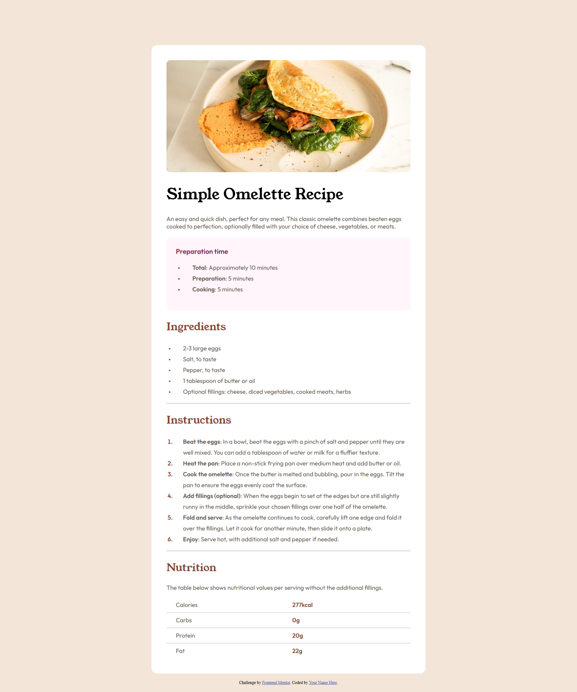
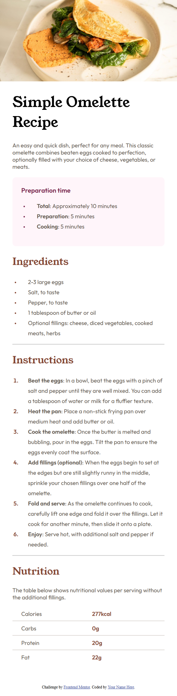

# Frontend Mentor - Recipe page solution

This is a solution to the [Recipe page challenge on Frontend Mentor](https://www.frontendmentor.io/challenges/recipe-page-KiTsR8QQKm).

## Table of contents

- [Overview](#overview)
  - [The challenge](#the-challenge)
  - [Screenshot](#screenshot)
  - [Links](#links)
- [My process](#my-process)
  - [Built with](#built-with)
- [Author](#author)

## Overview

### Screenshot
#### My Desktopk design result

#### My Mobile Design Result

### Links

- Solution URL: [FRONTEND SOLUTION](https://www.frontendmentor.io/solutions/recipe-page-using-responsive-design-u2pppvIgbJ)
- Live Site URL: [LIVE SITE](https://ness505.github.io/Recipe-Page/)

## My process

### Built with

- Semantic HTML5 markup
- CSS 

## Author

- Frontend Mentor - [@ness505](https://www.frontendmentor.io/profile/ness505)
